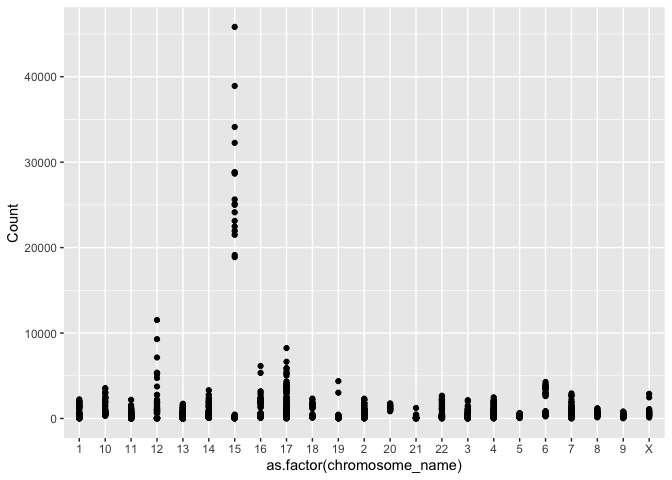
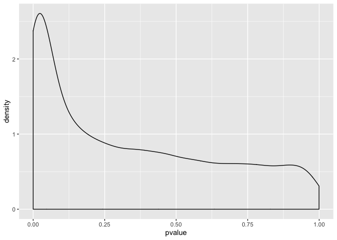

## R Markdown

This is an R Markdown document. Markdown is a simple formatting syntax for authoring HTML, PDF, and MS Word documents. For more details on using R Markdown see <http://rmarkdown.rstudio.com>.

When you click the **Knit** button a document will be generated that includes both content as well as the output of any embedded R code chunks within the document. You can embed an R code chunk like this:


```r
#if (!requireNamespace("BiocManager", quietly = TRUE))
#   install.packages("BiocManager")
#BiocManager::install("GEOquery")
#BiocManager::install("biomaRt")
library(GEOquery)
```

```
## Warning: package 'GEOquery' was built under R version 3.5.2
```

```
## Loading required package: Biobase
```

```
## Loading required package: BiocGenerics
```

```
## Loading required package: parallel
```

```
## 
## Attaching package: 'BiocGenerics'
```

```
## The following objects are masked from 'package:parallel':
## 
##     clusterApply, clusterApplyLB, clusterCall, clusterEvalQ,
##     clusterExport, clusterMap, parApply, parCapply, parLapply,
##     parLapplyLB, parRapply, parSapply, parSapplyLB
```

```
## The following objects are masked from 'package:stats':
## 
##     IQR, mad, sd, var, xtabs
```

```
## The following objects are masked from 'package:base':
## 
##     anyDuplicated, append, as.data.frame, basename, cbind, colMeans,
##     colnames, colSums, dirname, do.call, duplicated, eval, evalq,
##     Filter, Find, get, grep, grepl, intersect, is.unsorted, lapply,
##     lengths, Map, mapply, match, mget, order, paste, pmax, pmax.int,
##     pmin, pmin.int, Position, rank, rbind, Reduce, rowMeans, rownames,
##     rowSums, sapply, setdiff, sort, table, tapply, union, unique,
##     unsplit, which, which.max, which.min
```

```
## Welcome to Bioconductor
## 
##     Vignettes contain introductory material; view with
##     'browseVignettes()'. To cite Bioconductor, see
##     'citation("Biobase")', and for packages 'citation("pkgname")'.
```

```
## Setting options('download.file.method.GEOquery'='auto')
```

```
## Setting options('GEOquery.inmemory.gpl'=FALSE)
```

```r
library(biomaRt)
#install.packages("tidyverse")
library(tidyverse)
```

```
## Warning: package 'tidyverse' was built under R version 3.5.2
```

```
## ── Attaching packages ───────────────────────────────────────────────────────────────── tidyverse 1.3.0 ──
```

```
## ✓ ggplot2 3.2.1     ✓ purrr   0.3.3
## ✓ tibble  2.1.3     ✓ dplyr   0.8.3
## ✓ tidyr   1.0.0     ✓ stringr 1.4.0
## ✓ readr   1.3.1     ✓ forcats 0.4.0
```

```
## Warning: package 'ggplot2' was built under R version 3.5.2
```

```
## Warning: package 'tibble' was built under R version 3.5.2
```

```
## Warning: package 'tidyr' was built under R version 3.5.2
```

```
## Warning: package 'purrr' was built under R version 3.5.2
```

```
## Warning: package 'dplyr' was built under R version 3.5.2
```

```
## Warning: package 'stringr' was built under R version 3.5.2
```

```
## Warning: package 'forcats' was built under R version 3.5.2
```

```
## ── Conflicts ──────────────────────────────────────────────────────────────────── tidyverse_conflicts() ──
## x dplyr::combine()    masks Biobase::combine(), BiocGenerics::combine()
## x dplyr::filter()     masks stats::filter()
## x dplyr::lag()        masks stats::lag()
## x ggplot2::Position() masks BiocGenerics::Position(), base::Position()
## x dplyr::select()     masks biomaRt::select()
```

```r
#install.packages("data.table")
library(data.table)
```

```
## Warning: package 'data.table' was built under R version 3.5.2
```

```
## 
## Attaching package: 'data.table'
```

```
## The following objects are masked from 'package:dplyr':
## 
##     between, first, last
```

```
## The following object is masked from 'package:purrr':
## 
##     transpose
```

```r
#install.packages("reshape2")
library(reshape2)
```

```
## 
## Attaching package: 'reshape2'
```

```
## The following objects are masked from 'package:data.table':
## 
##     dcast, melt
```

```
## The following object is masked from 'package:tidyr':
## 
##     smiths
```

```r
gds <- getGEO("GDS507")
```

```
## File stored at:
```

```
## /var/folders/y9/mswdjl0s0fsbc0nwk2x70xw40000gn/T//Rtmp1v7DHQ/GDS507.soft.gz
```

```
## Parsed with column specification:
## cols(
##   ID_REF = col_character(),
##   IDENTIFIER = col_character(),
##   GSM11815 = col_double(),
##   GSM11832 = col_double(),
##   GSM12069 = col_double(),
##   GSM12083 = col_double(),
##   GSM12101 = col_double(),
##   GSM12106 = col_double(),
##   GSM12274 = col_double(),
##   GSM12299 = col_double(),
##   GSM12412 = col_double(),
##   GSM11810 = col_double(),
##   GSM11827 = col_double(),
##   GSM12078 = col_double(),
##   GSM12099 = col_double(),
##   GSM12269 = col_double(),
##   GSM12287 = col_double(),
##   GSM12301 = col_double(),
##   GSM12448 = col_double()
## )
```

```r
#we can use str() to peak at the structure of a data object. 
str(gds)
```

```
## Formal class 'GDS' [package "GEOquery"] with 3 slots
##   ..@ gpl      :Formal class 'GPL' [package "GEOquery"] with 2 slots
##   .. .. ..@ dataTable:Formal class 'GEODataTable' [package "GEOquery"] with 2 slots
##   .. .. .. .. ..@ columns:'data.frame':	0 obs. of  0 variables
##   .. .. .. .. ..@ table  :'data.frame':	0 obs. of  0 variables
##   .. .. ..@ header   : list()
##   ..@ dataTable:Formal class 'GEODataTable' [package "GEOquery"] with 2 slots
##   .. .. ..@ columns:'data.frame':	17 obs. of  4 variables:
##   .. .. .. ..$ sample       : Factor w/ 17 levels "GSM11810","GSM11815",..: 2 4 5 7 9 10 12 14 16 1 ...
##   .. .. .. ..$ disease.state: Factor w/ 2 levels "normal","RCC": 2 2 2 2 2 2 2 2 2 1 ...
##   .. .. .. ..$ individual   : Factor w/ 10 levels "001","005","011",..: 6 4 1 2 3 5 8 9 10 6 ...
##   .. .. .. ..$ description  : chr [1:17] "Value for GSM11815: C035 Renal Clear Cell Carcinoma U133B; src: Trizol isolation of total RNA from Renal Clear "| __truncated__ "Value for GSM11832: C023 Renal Clear Cell Carcinoma U133B; src: Trizol isolation of total RNA from Renal Clear "| __truncated__ "Value for GSM12069: C001 Renal Clear Cell Carcinoma U133B; src: Trizol isolation of total RNA from Renal Clear "| __truncated__ "Value for GSM12083: C005 Renal Clear Cell Carcinoma U133B; src: Trizol isolation of total RNA from Renal Clear "| __truncated__ ...
##   .. .. ..@ table  :'data.frame':	22645 obs. of  19 variables:
##   .. .. .. ..$ ID_REF    : chr [1:22645] "200000_s_at" "200001_at" "200002_at" "200003_s_at" ...
##   .. .. .. ..$ IDENTIFIER: chr [1:22645] "PRPF8" "CAPNS1" "RPL35" "MIR6805" ...
##   .. .. .. ..$ GSM11815  : num [1:22645] 4254 17996 41679 65391 19030 ...
##   .. .. .. ..$ GSM11832  : num [1:22645] 5298 12011 39117 34806 15814 ...
##   .. .. .. ..$ GSM12069  : num [1:22645] 4026 10284 38759 31257 16356 ...
##   .. .. .. ..$ GSM12083  : num [1:22645] 3498 2535 32848 28308 9580 ...
##   .. .. .. ..$ GSM12101  : num [1:22645] 3566 11048 39634 67448 14274 ...
##   .. .. .. ..$ GSM12106  : num [1:22645] 4903 13354 43511 56990 17217 ...
##   .. .. .. ..$ GSM12274  : num [1:22645] 6373 8564 46857 57972 19117 ...
##   .. .. .. ..$ GSM12299  : num [1:22645] 4829 17248 47032 57570 17488 ...
##   .. .. .. ..$ GSM12412  : num [1:22645] 5206 16018 22152 29062 14672 ...
##   .. .. .. ..$ GSM11810  : num [1:22645] 2757 6077 26661 35141 17733 ...
##   .. .. .. ..$ GSM11827  : num [1:22645] 3932 15704 26374 23629 18022 ...
##   .. .. .. ..$ GSM12078  : num [1:22645] 3730 10138 23810 22100 17957 ...
##   .. .. .. ..$ GSM12099  : num [1:22645] 3223 11614 24749 21651 15958 ...
##   .. .. .. ..$ GSM12269  : num [1:22645] 3640 8460 21937 18551 15800 ...
##   .. .. .. ..$ GSM12287  : num [1:22645] 4886 10283 31463 23496 16686 ...
##   .. .. .. ..$ GSM12301  : num [1:22645] 4070 11844 22734 21315 18817 ...
##   .. .. .. ..$ GSM12448  : num [1:22645] 3482 9742 25396 28631 17421 ...
##   .. .. .. ..- attr(*, "spec")=
##   .. .. .. .. .. cols(
##   .. .. .. .. ..   ID_REF = col_character(),
##   .. .. .. .. ..   IDENTIFIER = col_character(),
##   .. .. .. .. ..   GSM11815 = col_double(),
##   .. .. .. .. ..   GSM11832 = col_double(),
##   .. .. .. .. ..   GSM12069 = col_double(),
##   .. .. .. .. ..   GSM12083 = col_double(),
##   .. .. .. .. ..   GSM12101 = col_double(),
##   .. .. .. .. ..   GSM12106 = col_double(),
##   .. .. .. .. ..   GSM12274 = col_double(),
##   .. .. .. .. ..   GSM12299 = col_double(),
##   .. .. .. .. ..   GSM12412 = col_double(),
##   .. .. .. .. ..   GSM11810 = col_double(),
##   .. .. .. .. ..   GSM11827 = col_double(),
##   .. .. .. .. ..   GSM12078 = col_double(),
##   .. .. .. .. ..   GSM12099 = col_double(),
##   .. .. .. .. ..   GSM12269 = col_double(),
##   .. .. .. .. ..   GSM12287 = col_double(),
##   .. .. .. .. ..   GSM12301 = col_double(),
##   .. .. .. .. ..   GSM12448 = col_double()
##   .. .. .. .. .. )
##   ..@ header   :List of 23
##   .. ..$ channel_count           : chr "1"
##   .. ..$ dataset_id              : chr [1:12] "GDS507" "GDS507" "GDS507" "GDS507" ...
##   .. ..$ description             : chr [1:13] "Investigation into mechanisms of renal clear cell carcinogenesis (RCC). Comparison of renal clear cell tumor ti"| __truncated__ "RCC" "normal" "035" ...
##   .. ..$ email                   : chr "geo@ncbi.nlm.nih.gov"
##   .. ..$ feature_count           : chr "22645"
##   .. ..$ institute               : chr "NCBI NLM NIH"
##   .. ..$ name                    : chr "Gene Expression Omnibus (GEO)"
##   .. ..$ order                   : chr "none"
##   .. ..$ platform                : chr "GPL97"
##   .. ..$ platform_organism       : chr "Homo sapiens"
##   .. ..$ platform_technology_type: chr "in situ oligonucleotide"
##   .. ..$ pubmed_id               : chr "14641932"
##   .. ..$ ref                     : chr "Nucleic Acids Res. 2005 Jan 1;33 Database Issue:D562-6"
##   .. ..$ reference_series        : chr "GSE781"
##   .. ..$ sample_count            : chr "17"
##   .. ..$ sample_id               : chr [1:12] "GSM11815,GSM11832,GSM12069,GSM12083,GSM12101,GSM12106,GSM12274,GSM12299,GSM12412" "GSM11810,GSM11827,GSM12078,GSM12099,GSM12269,GSM12287,GSM12301,GSM12448" "GSM11810,GSM11815" "GSM11827,GSM11832" ...
##   .. ..$ sample_organism         : chr "Homo sapiens"
##   .. ..$ sample_type             : chr "RNA"
##   .. ..$ title                   : chr "Renal clear cell carcinoma (HG-U133B)"
##   .. ..$ type                    : chr [1:13] "Expression profiling by array" "disease state" "disease state" "individual" ...
##   .. ..$ update_date             : chr "Mar 04 2004"
##   .. ..$ value_type              : chr "count"
##   .. ..$ web_link                : chr "http://www.ncbi.nlm.nih.gov/geo"
```

```r
meta_data <- data.frame(Sample = gds@dataTable@columns$sample, disease = gds@dataTable@columns$disease.state)
#we grab this info from the appropriate slots above. 

gds_data <- gds@dataTable@table

head(gds_data)
```

```
##        ID_REF IDENTIFIER GSM11815 GSM11832 GSM12069 GSM12083 GSM12101 GSM12106
## 1 200000_s_at      PRPF8   4254.0   5298.2   4026.5   3498.4   3566.4   4903.1
## 2   200001_at     CAPNS1  17996.2  12010.7  10283.5   2534.7  11048.4  13354.0
## 3   200002_at      RPL35  41678.8  39116.9  38758.9  32847.7  39633.9  43511.2
## 4 200003_s_at    MIR6805  65390.9  34806.2  31257.2  28308.5  67447.5  56989.9
## 5   200004_at     EIF4G2  19030.1  15813.6  16355.7   9579.7  14273.5  17217.0
## 6   200005_at      EIF3D   8824.5   9706.2  10590.0   6986.7   9400.4  12835.2
##   GSM12274 GSM12299 GSM12412 GSM11810 GSM11827 GSM12078 GSM12099 GSM12269
## 1   6372.6   4829.1   5205.8   2756.8   3932.0   3729.9   3223.4   3640.5
## 2   8563.8  17247.6  16018.5   6077.0  15703.8  10138.5  11614.4   8460.5
## 3  46856.7  47032.4  22152.2  26660.7  26373.6  23809.6  24749.3  21936.8
## 4  57972.5  57570.5  29062.2  35140.9  23629.3  22100.5  21651.0  18550.7
## 5  19116.9  17487.6  14671.6  17733.1  18022.4  17957.4  15958.0  15799.8
## 6  10299.0  12375.2   7645.4   8661.5   7355.7   6973.4   6855.9   7949.2
##   GSM12287 GSM12301 GSM12448
## 1   4886.3   4070.2   3482.1
## 2  10282.6  11844.3   9741.6
## 3  31462.8  22733.7  25395.5
## 4  23496.5  21315.4  28631.4
## 5  16685.8  18817.3  17421.1
## 6   9486.5   7494.5   7252.1
```

```r
nrow(gds_data)
```

```
## [1] 22645
```

```r
ncol(gds_data)
```

```
## [1] 19
```

```r
#some gene names are duplicated, because there are multiple probes that map to the same gene
#We exclude the first and second columns because they hold the probe and gene names, respectively. 
apply(gds_data[,-c(1, 2)], 2, median)
```

```
## GSM11815 GSM11832 GSM12069 GSM12083 GSM12101 GSM12106 GSM12274 GSM12299 
##    265.6    250.3    218.5    309.7    281.9    240.1    280.2    217.0 
## GSM12412 GSM11810 GSM11827 GSM12078 GSM12099 GSM12269 GSM12287 GSM12301 
##    264.4    273.8    264.6    266.5    269.3    288.6    238.7    244.5 
## GSM12448 
##    264.3
```

```r
head(iris)
```

```
##   Sepal.Length Sepal.Width Petal.Length Petal.Width Species
## 1          5.1         3.5          1.4         0.2  setosa
## 2          4.9         3.0          1.4         0.2  setosa
## 3          4.7         3.2          1.3         0.2  setosa
## 4          4.6         3.1          1.5         0.2  setosa
## 5          5.0         3.6          1.4         0.2  setosa
## 6          5.4         3.9          1.7         0.4  setosa
```

```r
glimpse(iris)
```

```
## Observations: 150
## Variables: 5
## $ Sepal.Length <dbl> 5.1, 4.9, 4.7, 4.6, 5.0, 5.4, 4.6, 5.0, 4.4, 4.9, 5.4, 4…
## $ Sepal.Width  <dbl> 3.5, 3.0, 3.2, 3.1, 3.6, 3.9, 3.4, 3.4, 2.9, 3.1, 3.7, 3…
## $ Petal.Length <dbl> 1.4, 1.4, 1.3, 1.5, 1.4, 1.7, 1.4, 1.5, 1.4, 1.5, 1.5, 1…
## $ Petal.Width  <dbl> 0.2, 0.2, 0.2, 0.2, 0.2, 0.4, 0.3, 0.2, 0.2, 0.1, 0.2, 0…
## $ Species      <fct> setosa, setosa, setosa, setosa, setosa, setosa, setosa, …
```

```r
#select all rows with sepal length greater than 5. 
iris %>% 
    filter(Sepal.Length > 5) %>% 
    head()
```

```
##   Sepal.Length Sepal.Width Petal.Length Petal.Width Species
## 1          5.1         3.5          1.4         0.2  setosa
## 2          5.4         3.9          1.7         0.4  setosa
## 3          5.4         3.7          1.5         0.2  setosa
## 4          5.8         4.0          1.2         0.2  setosa
## 5          5.7         4.4          1.5         0.4  setosa
## 6          5.4         3.9          1.3         0.4  setosa
```

```r
iris %>% 
    group_by(Species) %>% 
    head()
```

```
## # A tibble: 6 x 5
## # Groups:   Species [1]
##   Sepal.Length Sepal.Width Petal.Length Petal.Width Species
##          <dbl>       <dbl>        <dbl>       <dbl> <fct>  
## 1          5.1         3.5          1.4         0.2 setosa 
## 2          4.9         3            1.4         0.2 setosa 
## 3          4.7         3.2          1.3         0.2 setosa 
## 4          4.6         3.1          1.5         0.2 setosa 
## 5          5           3.6          1.4         0.2 setosa 
## 6          5.4         3.9          1.7         0.4 setosa
```

```r
#select the column called "Sepal.Width"
iris %>% 
    dplyr::select(Sepal.Width) %>% 
    head()
```

```
##   Sepal.Width
## 1         3.5
## 2         3.0
## 3         3.2
## 4         3.1
## 5         3.6
## 6         3.9
```

```r
iris %>%
    group_by(Species) %>% 
    mutate(Capitalized_names = toupper(Species)) %>% 
    head()
```

```
## # A tibble: 6 x 6
## # Groups:   Species [1]
##   Sepal.Length Sepal.Width Petal.Length Petal.Width Species Capitalized_names
##          <dbl>       <dbl>        <dbl>       <dbl> <fct>   <chr>            
## 1          5.1         3.5          1.4         0.2 setosa  SETOSA           
## 2          4.9         3            1.4         0.2 setosa  SETOSA           
## 3          4.7         3.2          1.3         0.2 setosa  SETOSA           
## 4          4.6         3.1          1.5         0.2 setosa  SETOSA           
## 5          5           3.6          1.4         0.2 setosa  SETOSA           
## 6          5.4         3.9          1.7         0.4 setosa  SETOSA
```

```r
iris %>% 
    group_by(Species) %>% 
    summarize(average_sepal_length = mean(Sepal.Length), n = n()) %>% 
    head()
```

```
## # A tibble: 3 x 3
##   Species    average_sepal_length     n
##   <fct>                     <dbl> <int>
## 1 setosa                     5.01    50
## 2 versicolor                 5.94    50
## 3 virginica                  6.59    50
```

```r
iris %>% 
    arrange(desc(Species)) %>% 
    head()
```

```
##   Sepal.Length Sepal.Width Petal.Length Petal.Width   Species
## 1          6.3         3.3          6.0         2.5 virginica
## 2          5.8         2.7          5.1         1.9 virginica
## 3          7.1         3.0          5.9         2.1 virginica
## 4          6.3         2.9          5.6         1.8 virginica
## 5          6.5         3.0          5.8         2.2 virginica
## 6          7.6         3.0          6.6         2.1 virginica
```

```r
#join band members with their instruments by "name"
band_members %>% left_join(band_instruments) 
```

```
## Joining, by = "name"
```

```
## # A tibble: 3 x 3
##   name  band    plays 
##   <chr> <chr>   <chr> 
## 1 Mick  Stones  <NA>  
## 2 John  Beatles guitar
## 3 Paul  Beatles bass
```

```r
melted_data <- melt(gds_data, id.vars = c("ID_REF", "IDENTIFIER"), var = "Sample")
head(melted_data)
```

```
##        ID_REF IDENTIFIER   Sample   value
## 1 200000_s_at      PRPF8 GSM11815  4254.0
## 2   200001_at     CAPNS1 GSM11815 17996.2
## 3   200002_at      RPL35 GSM11815 41678.8
## 4 200003_s_at    MIR6805 GSM11815 65390.9
## 5   200004_at     EIF4G2 GSM11815 19030.1
## 6   200005_at      EIF3D GSM11815  8824.5
```

```r
melted_data %>% 
    group_by(Sample) %>% 
    summarize(mean = mean(value))
```

```
## # A tibble: 17 x 2
##    Sample    mean
##    <fct>    <dbl>
##  1 GSM11815  751.
##  2 GSM11832  742.
##  3 GSM12069  748.
##  4 GSM12083  735.
##  5 GSM12101  803.
##  6 GSM12106  744.
##  7 GSM12274  761.
##  8 GSM12299  802.
##  9 GSM12412  685.
## 10 GSM11810  765.
## 11 GSM11827  780.
## 12 GSM12078  774.
## 13 GSM12099  766.
## 14 GSM12269  710.
## 15 GSM12287  791.
## 16 GSM12301  770.
## 17 GSM12448  757.
```

```r
(new_melted_data <- melted_data %>% 
    group_by(Sample, IDENTIFIER) %>% 
    summarize(Count = mean(value)))
```

```
## # A tibble: 279,905 x 3
## # Groups:   Sample [17]
##    Sample   IDENTIFIER   Count
##    <fct>    <chr>        <dbl>
##  1 GSM11815 --Control   8139. 
##  2 GSM11815 222968_at    102. 
##  3 GSM11815 223641_at    200. 
##  4 GSM11815 224429_x_at 2385. 
##  5 GSM11815 224438_at     32.1
##  6 GSM11815 225714_s_at  291. 
##  7 GSM11815 225934_at    284. 
##  8 GSM11815 226014_at     66.3
##  9 GSM11815 226061_s_at   45.1
## 10 GSM11815 226138_s_at   23.3
## # … with 279,895 more rows
```

```r
#open connection between biomaRt and R. 
human = useMart("ensembl", dataset = "hsapiens_gene_ensembl")
#function that takes in data frame, and outputs same data frame with associated chromosome annotations.
identify_gene_names <- function(df){
    names(df) <- c("Sample", "hgnc_symbol", "Count")
    names <- getBM( attributes=c("hgnc_symbol", "chromosome_name") , filters= "hgnc_symbol", values = unique(df$hgnc_symbol), mart = human)
    left_join(df, names, by = "hgnc_symbol")
}


#There's a lot of variation in how the chromosomal location is annotated. To simplify things, let's filter out all genes with annotations that are not numeric numbers between 1 and 23, X or Y. 
data_with_chromosome <- identify_gene_names(new_melted_data) %>% 
    filter(chromosome_name %in% c(1:23, "X", "Y"))
full_data <- left_join(data_with_chromosome, meta_data, by = "Sample")
```

```
## Warning: Column `Sample` joining factors with different levels, coercing to
## character vector
```

```r
full_data %>% 
    group_by(disease) %>% 
    filter(chromosome_name == "X") %>% 
    summarize(mean = mean(Count))
```

```
## # A tibble: 2 x 2
##   disease  mean
##   <fct>   <dbl>
## 1 normal   686.
## 2 RCC      658.
```

```r
#choose random number between 1 and however many genes we have. 
set.seed(5747540)
sample_to_choose <- sample(1:length(unique(full_data$hgnc_symbol)), size = 100)
#choose genes that correspond to those numbers in a list of genes. 
names_to_choose <- as.character(unique(full_data$hgnc_symbol)[sample_to_choose])
full_data %>% 
    filter(hgnc_symbol %in% names_to_choose) %>% 
    group_by(Sample) %>% 
    ggplot(aes(x = as.factor(chromosome_name), y = Count)) + geom_point()
```

<!-- -->

```r
head(full_data)
```

```
## # A tibble: 6 x 5
## # Groups:   Sample [1]
##   Sample   hgnc_symbol Count chromosome_name disease
##   <chr>    <chr>       <dbl> <chr>           <fct>  
## 1 GSM11815 A1BG        191.  19              RCC    
## 2 GSM11815 A1BG-AS1     53   19              RCC    
## 3 GSM11815 A1CF        188.  10              RCC    
## 4 GSM11815 A2MP1       442.  12              RCC    
## 5 GSM11815 AADACL2      14.9 3               RCC    
## 6 GSM11815 AADAT       448.  4               RCC
```

```r
full_data %>% 
    filter(hgnc_symbol %in% names_to_choose) %>% 
    group_by(Sample) %>% 
    mutate(Rate = Count/sum(Count))%>% 
    mutate(sum_Count = sum(Count))
```

```
## # A tibble: 1,700 x 7
## # Groups:   Sample [17]
##    Sample   hgnc_symbol  Count chromosome_name disease     Rate sum_Count
##    <chr>    <chr>        <dbl> <chr>           <fct>      <dbl>     <dbl>
##  1 GSM11815 ADAMTS1       71.3 21              RCC     0.000810    87985.
##  2 GSM11815 AGAP2         20   12              RCC     0.000227    87985.
##  3 GSM11815 AGR3          61   7               RCC     0.000693    87985.
##  4 GSM11815 ALKBH5      3750.  17              RCC     0.0426      87985.
##  5 GSM11815 BACE1        869.  11              RCC     0.00988     87985.
##  6 GSM11815 BCAR4        348.  16              RCC     0.00396     87985.
##  7 GSM11815 BCR         1229.  22              RCC     0.0140      87985.
##  8 GSM11815 C14orf28     403.  14              RCC     0.00458     87985.
##  9 GSM11815 C19orf47      69.1 19              RCC     0.000785    87985.
## 10 GSM11815 C4orf17       82.8 4               RCC     0.000941    87985.
## # … with 1,690 more rows
```

```r
    #ggplot(aes(x = as.factor(chromosome_name), y = sum_Count) + geom_point()
full_data %>% 
    group_by(hgnc_symbol) %>% 
    summarize( pvalue = t.test(Count ~ disease)$p.value)%>%
    ggplot() + geom_density(aes(x=pvalue))
```

<!-- -->

